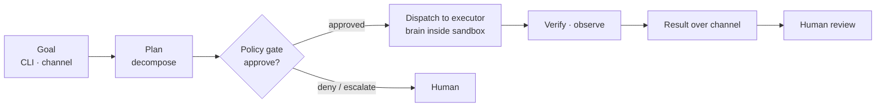

# agent-builder

[](LICENSE)
[](go.mod)
[](https://github.com/tkdtaylor/agent-builder/commits)

**A security-first, general autonomous agent.** You hand it a goal; it works toward
it and returns the result — running a capable existing agent (Claude Code, a
local model, or Antigravity) as its reasoning brain *inside* a security envelope:
sandboxed execution, a policy gate on every action, brokered credentials the agent
never sees, and a tamper-evident audit trail. It **composes** that brain and the
security seams; it does not reimplement reasoning.

It's built for **operators who want an agent they can actually let run** — one whose
autonomy is bounded by machine-checkable verification and two human gates (approve the
plan, review the result) rather than by trust. Part of the
[Secure Agent Ecosystem](#the-building-blocks), Apache-2.0 licensed.

> **Status.** The one path that runs unattended today is autonomous coding — the first
> reference build. The general front door (`orchestrate`, `ask`) works locally; a Telegram
> channel, cross-session memory, and non-coding execution are still on the roadmap.

## Contents

- [Quick start](#quick-start)
- [How it works](#how-it-works)
- [The building blocks](#the-building-blocks)
- [Running it](#running-it)
- [Develop locally](#develop-locally)
- [Tech stack](#tech-stack)
- [License](#license)

## Quick start

The fastest way to see it work needs only a Claude credential — no containers, no repo,
no gate. `ask` hands your prompt to a brain and prints the answer:

```bash
git clone https://github.com/tkdtaylor/agent-builder && cd agent-builder
export CLAUDE_CODE_OAUTH_TOKEN=...        # from `claude setup-token` (or ANTHROPIC_API_KEY)

go run ./cmd/agent-builder ask "summarize what this repo's verification gate checks"
```

To hand it a *goal* it plans and executes — or run it unattended against a repo —
see [Running it](#running-it).

## How it works

You give the agent a goal. It plans, gets each step past a policy gate, dispatches the
work to a composed brain running inside a sandbox, verifies or observes the outcome, and
reports back over the channel the request came in on. Humans sit at two gates — plan
approval and result review — plus an escalation path when the agent gets stuck.



The pieces that make this safe to leave running:

- **Composed brain, pluggable executor.** The executor seam is `(harness, model) → result`.
  Claude Code and Antigravity bundle harness + model; a local Ollama model supplies
  the harness. The agent routes across them by quota, sensitivity, and cost.
- **Verification is the definition of done.** Unattended, the agent's only ground truth is
  a machine-checkable gate. For the coding reference build that gate is tests + build +
  lint + supply-chain scans; nothing is "done" until it's green.
- **Containment.** Rootless Podman with a tiered runtime (`runc` → gVisor → Kata/Firecracker)
  and a default-deny egress allowlist. [`armor`](https://github.com/tkdtaylor/armor) guards
  the web-ingestion and tool-call path.
- **No unattended self-modification.** The agent reads its own repo but never autonomously
  edits its own gate, escalation path, or control plane. Self-improvement happens through
  reviewable, sandboxed skills — not core edits.

Deeper detail: [architecture overview](docs/architecture/overview.md),
[diagrams](docs/architecture/diagrams.md), and the [spec](docs/spec/SPEC.md).

## The building blocks

The Secure Agent Ecosystem ships its security as small, standalone blocks rather than one
framework. agent-builder composes these over their published contracts — each block's own
`## Scope` section is the authoritative statement of what it owns.

| Block | What it does | In agent-builder |
|---|---|---|
| [exec-sandbox](https://github.com/tkdtaylor/exec-sandbox) | OS execution isolation — tiered runtime, resource limits, default-deny egress proxy | ✅ default run backend |
| [vault](https://github.com/tkdtaylor/vault) | JIT zero-knowledge secret store; secrets resolve to single-use handles the agent never sees | ✅ git/GitHub token brokering |
| [policy-engine](https://github.com/tkdtaylor/policy-engine) | Out-of-process authorization (OPA/Rego + Cedar); risk→tier scoring, `require_approval` gate | ✅ opt-in gate before dispatch |
| [audit-trail](https://github.com/tkdtaylor/audit-trail) | Tamper-evident, hash-chained log; signed checkpoints, Rekor anchoring | ✅ emit + verify |
| [armor](https://github.com/tkdtaylor/armor) | LLM-guard on the web-ingestion + tool-call path — injection / jailbreak / exfil detection | ✅ fail-closed ingestion guard |
| [dep-scan](https://github.com/tkdtaylor/dep-scan) | Supply-chain CVE scan of dependencies | ✅ blocking step in the gate |
| [code-scanner](https://github.com/tkdtaylor/code-scanner) | Malware scan of code and skills before they run | ✅ blocking step in the gate |
| [memory-guard](https://github.com/tkdtaylor/memory-guard) | Memory-I/O gate against poisoning | ◻️ targeted, not yet composed |
| [agent-mesh](https://github.com/tkdtaylor/agent-mesh) | Signed inter-agent envelopes with replay prevention | ◻️ targeted, not yet composed |

The [roadmap](docs/plans/roadmap.md) is the source of truth for exactly what is wired and
at what verification level.

## Running it

Three entry points, from simplest to most capable:

**`ask` — a single-shot answer.** No worktree, no gate, no branch. This is the
[quick start](#quick-start) above.

**`orchestrate` — the general goal-intake front door.** Reads goals from a channel,
decomposes each into a plan, gates the plan and every worker on a policy decision, and
dispatches one worker per approved sub-goal — reporting back over the same channel. The
supported channel today is local stdin; a Telegram channel is wired but not yet tested
end-to-end. One message per line:

```
build a CLI that prints the current git branch
status                     # fleet-wide status
confirm goal-1             # approve a plan awaiting operator approval
cancel goal-1              # cancel a goal
```

**`run` — one unattended coding task.** Picks one ready task from a target repo, sandboxes
it, runs a Claude executor, passes it through the verification gate, and opens a PR on
success (escalates on fail). You review and merge, then run again for the next task.

Both `orchestrate` and `run` need the operator prerequisites — rootless Podman + a runtime,
the gate toolchain, `git`/`gh` authenticated, and a Claude credential — plus environment
configuration. The **[operator guide](docs/operating.md)** walks through setup end to end;
[configuration.md](docs/spec/configuration.md) is the exhaustive environment reference.

Other subcommands: `agent-builder version`, `agent-builder verify <repo>` (run just the
gate against a checkout), `agent-builder verify-checkpoint` (verify a signed audit
checkpoint).

## Develop locally

```bash
go test ./...                 # tests
go build ./...                # compile
make check                    # the verification gate: lint + test + fitness
go run ./cmd/agent-builder version
```

Contributing runs through a test-spec-first, one-task-one-branch workflow. Read
[AGENTS.md](AGENTS.md) (the canonical, harness-neutral briefing) and
[CONTRIBUTING.md](CONTRIBUTING.md) before starting; tasks and their specs live under
[docs/tasks/](docs/tasks/).

## Tech stack

Go 1.26 — CLI and container orchestration over provider CLIs and rootless Podman. See
[tech-stack.md](docs/architecture/tech-stack.md).

## License

[Apache License 2.0](LICENSE) — consistent with the other blocks in the Secure Agent
Ecosystem. See [NOTICE](NOTICE) for attribution and disclaimers, and
[CONTRIBUTING.md](CONTRIBUTING.md) for the inbound=outbound / DCO contribution terms.
