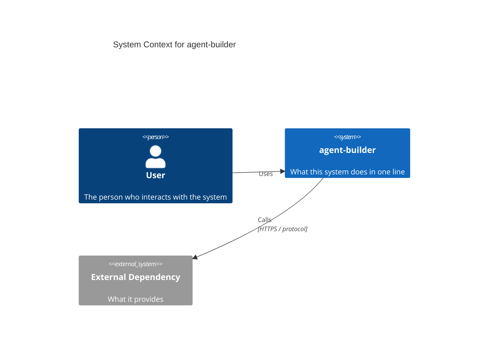
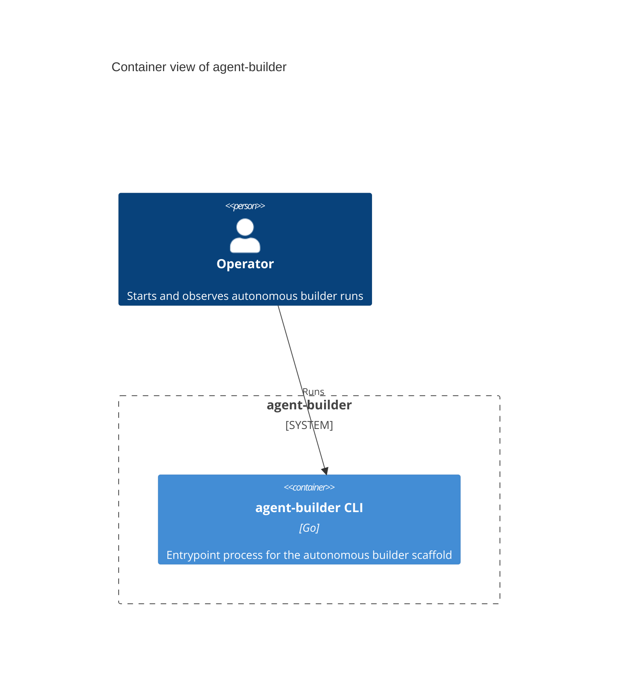
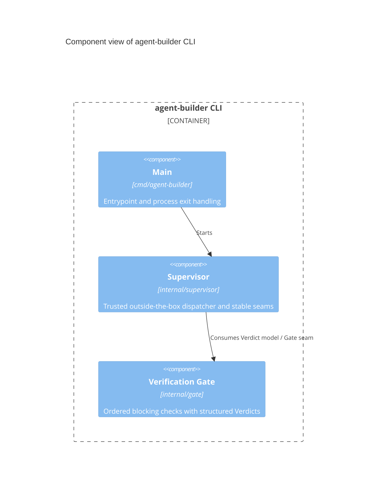
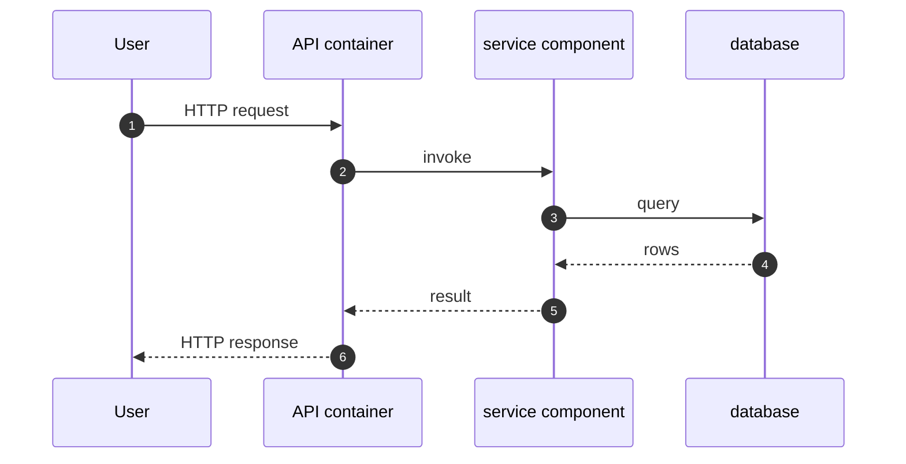

# Architecture Diagrams

**Project:** agent-builder
**Last updated:** 2026-06-05

C4-structured Mermaid diagrams covering the system at three progressively detailed levels (Context → Container → Component), plus the runtime sequence flows that show how those pieces collaborate. See [overview.md](overview.md) for prose context, [decisions/](decisions/) for the ADRs referenced here, and [`../spec/architecture.md`](../spec/architecture.md) for the structured element catalog these diagrams render.

These diagrams are part of the **authoritative spec** for this project. They are not just documentation about the code — they are a source-of-truth statement of how components are arranged and how data flows. Code changes that contradict a diagram either invalidate the change or invalidate the diagram; one must be updated to match the other in the same commit.

GitHub and most IDE markdown previewers render Mermaid natively — no build step required. Mermaid's `C4Context`, `C4Container`, `C4Component`, `C4Deployment`, and `C4Dynamic` blocks render as proper C4 diagrams.

> **Scaling rule.** Trivial systems (single container, no integrations) can collapse Container and Component into one section, or skip Container entirely. Large systems may split Component into one diagram per container (3a, 3b, …). The C4 levels are the *grammar* — use as many as the system actually needs. Per-flow runtime sequences (Section 4+) always belong here regardless of size.

---

## 1. System Context — who uses it and what it touches

> Top-level view: the system as one box, the people who use it, and the external systems it depends on. No internals. Update when a new actor or external dependency appears.

---

## 2. Containers — deployable units inside the system

> One level down: each independently deployable / runnable unit (process, service, database, queue, scheduled job). Show the technology choice on each container and the protocol on each edge.

---

## 3. Components — modules inside the main container

> One level deeper into whichever container is most worth zooming into — usually the one a new contributor will touch first. Show the major modules / packages and their dependencies. Add additional Component diagrams (3a, 3b, …) for other containers when they are non-trivial.

**Key contracts**
- ADR 002 fixes the gate shape: ordered Steps, structured Verdict, first-failure short-circuit, and no skip path.
- The supervisor remains trusted and dumb; the gate contains verification orchestration only, not executor/LLM/web logic.

---

## 4. Primary runtime flow

> The most important sequence through the system — the one a new contributor needs to understand first. Startup → first user action → response is a good default.

---

## Adding more diagrams

Add additional numbered sections (5., 6., …) for any of:

- **Per-flow sequence diagrams** — error handling, reconnect, batch processing, auth, etc. One per flow that crosses two or more components and matters to operate the system.
- **State machines** — if a subsystem has explicit states with transitions
- **Deployment topology** — `C4Deployment` if the runtime layout (nodes, hosts, regions) is non-obvious
- **Dynamic collaboration** — `C4Dynamic` for showing how containers collaborate during a specific use case

One concept per diagram. If a diagram tries to show both a component layout and a runtime sequence, split it.

---

## Maintaining these diagrams

- **Trigger to update:** any time a new actor, container, or component appears; a boundary moves; an external dependency is added or removed; an ADR changes a diagrammed flow. Keep [`../spec/architecture.md`](../spec/architecture.md) in sync — the catalog and these diagrams describe the same elements.
- **Edit existing over adding new.** Duplicates rot independently. If a diagram has grown unwieldy, split it by extracting a self-contained subflow into its own numbered section.
- **Note ADRs that don't change diagrams.** When an ADR introduces a refactor that preserves the diagrammed runtime shape, add a one-line note here saying so. This prevents future contributors from re-asking "should this have been drawn?"
- **Update the date at the top** when you change anything substantive.
