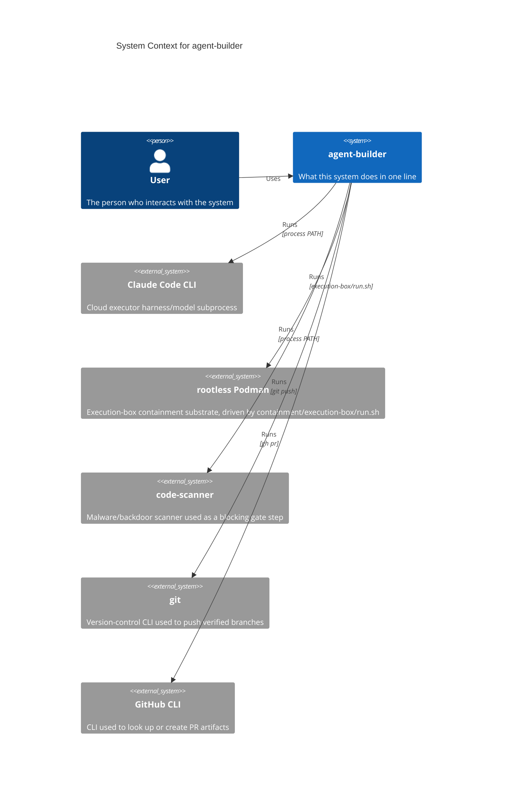
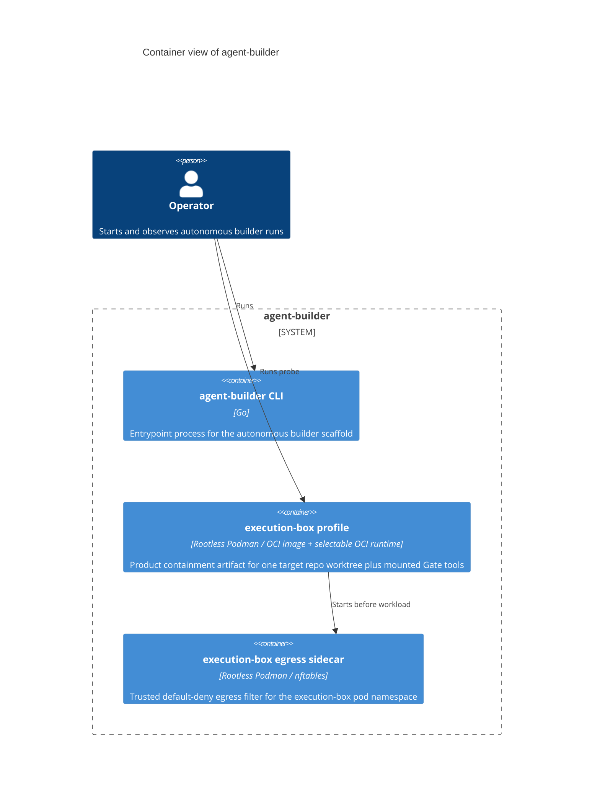

# Architecture Diagrams

**Project:** agent-builder
**Last updated:** 2026-06-19

C4-structured Mermaid diagrams covering the system at three progressively detailed levels (Context → Container → Component), plus the runtime sequence flows that show how those pieces collaborate. See [overview.md](overview.md) for prose context, [decisions/](decisions/) for the ADRs referenced here, and [`../spec/architecture.md`](../spec/architecture.md) for the structured element catalog these diagrams render.

These diagrams are part of the **authoritative spec** for this project. They are not just documentation about the code — they are a source-of-truth statement of how components are arranged and how data flows. Code changes that contradict a diagram either invalidate the change or invalidate the diagram; one must be updated to match the other in the same commit.

GitHub and most IDE markdown previewers render Mermaid natively — no build step required. Mermaid's `C4Context`, `C4Container`, `C4Component`, `C4Deployment`, and `C4Dynamic` blocks render as proper C4 diagrams.

> **Scaling rule.** Trivial systems (single container, no integrations) can collapse Container and Component into one section, or skip Container entirely. Large systems may split Component into one diagram per container (3a, 3b, …). The C4 levels are the *grammar* — use as many as the system actually needs. Per-flow runtime sequences (Section 4+) always belong here regardless of size.

---

## 1. System Context — who uses it and what it touches

> Top-level view: the system as one box, the people who use it, and the external systems it depends on. No internals. Update when a new actor or external dependency appears.



---

## 2. Containers — deployable units inside the system

> One level down: each independently deployable / runnable unit (process, service, database, queue, scheduled job). Show the technology choice on each container and the protocol on each edge.



---

## 3. Components — modules inside the main container

> One level deeper into whichever container is most worth zooming into — usually the one a new contributor will touch first. Show the major modules / packages and their dependencies. Add additional Component diagrams (3a, 3b, …) for other containers when they are non-trivial.

```mermaid
C4Component
    title Component view of agent-builder CLI

    System_Ext(codeScanner, "code-scanner", "Malware/backdoor scanner CLI")
    System_Ext(claudeCLI, "Claude Code CLI", "Cloud executor harness/model subprocess")
    System_Ext(execBoxLauncher, "execution-box launcher", "containment/execution-box/run.sh — rootless Podman + selectable OCI runtime")
    System_Ext(armorTool, "armor", "External LLM guard process/service")
    System_Ext(gitCLI, "git", "Version-control CLI")
    System_Ext(ghCLI, "GitHub CLI", "PR artifact CLI")

    Container_Boundary(boundary, "agent-builder CLI") {
        Component(main, "Main", "cmd/agent-builder", "Entrypoint and process exit handling")
        Component(runtime, "Default Run Wiring", "internal/runtime", "CLI bootstrap that composes configured Phase 0 adapters")
        Component(supervisor, "Supervisor", "internal/supervisor", "Trusted outside-the-box dispatcher, lifecycle logger, run-record writer, and stable seams")
        Component(agentloop, "Agent Loop", "internal/loop", "Inside-the-box pick-attempt-verify cycle plus bounded retry policy")
        Component(ingestion, "Ingestion Boundary", "internal/ingestion", "Typed content/tool-call candidates plus guard/broker release seam")
        Component(armorAdapter, "Armor Guard Adapter", "internal/armor", "External armor invocation adapter for ingestion decisions")
        Component(executorHarness, "Executor Ingestion Harness", "internal/executorharness", "Executor-facing event wrapper that emits broker-reviewed release values")
        Component(executor, "Claude CLI Executor", "internal/executor", "Concrete supervisor.Executor adapter with explicit web/tool policy")
        Component(sandbox, "exec-sandbox Run Adapter", "internal/sandbox", "Typed contained-command seam and test fake")
        Component(podmanAdapter, "Podman Adapter", "internal/sandbox/podman", "Concrete Podman-backed sandbox.Runner via the execution-box launcher")
        Component(tasksource, "Task Source", "internal/tasksource", "Read-only roadmap/task parser and next-task selector")
        Component(statuswriter, "Task Status Writer", "internal/tasksource", "Constrained task status mutation")
        Component(gate, "Verification Gate", "internal/gate", "Ordered blocking checks with structured Verdicts")
        Component(publisher, "Branch Publisher", "internal/publisher", "Pushes verified branches and records PR artifacts")
    }

    Rel(main, runtime, "Runs default pipeline")
    Rel(runtime, tasksource, "Selects one ready task")
    Rel(runtime, executor, "Constructs")
    Rel(runtime, gate, "Constructs production Gate")
    Rel(runtime, podmanAdapter, "Constructs")
    Rel(runtime, agentloop, "Constructs retrying in-box loop")
    Rel(runtime, statuswriter, "Constructs for escalation")
    Rel(runtime, publisher, "Constructs for post-Gate publication")
    Rel(runtime, supervisor, "Starts configured Run")
    Rel(supervisor, sandbox, "Stores Runner / box seam")
    Rel(podmanAdapter, sandbox, "Implements Runner seam")
    Rel(podmanAdapter, execBoxLauncher, "Invokes with worktree + typed limits")
    Rel(supervisor, gate, "Consumes Verdict model / Gate seam")
    Rel(agentloop, supervisor, "Consumes Task / Executor / Gate seams")
    Rel(executor, supervisor, "Implements Executor seam")
    Rel(executor, claudeCLI, "Invokes with task prompt")
    Rel(executor, executorHarness, "Routes Claude-facing web/tool events by policy")
    Rel(agentloop, tasksource, "Picks next task")
    Rel(agentloop, statuswriter, "Marks needs-human after exhausted retries")
    Rel(agentloop, executorHarness, "Uses when executor web/tool events are exposed")
    Rel(executorHarness, ingestion, "Builds candidates and reviews through Broker")
    Rel(executorHarness, armorAdapter, "Constructs armor-backed Guard wiring")
    Rel(ingestion, armorAdapter, "Calls Guard implementation")
    Rel(armorAdapter, armorTool, "Invokes over JSON")
    Rel(agentloop, gate, "Verifies target worktree")
    Rel(tasksource, supervisor, "Uses Task model")
    Rel(gate, codeScanner, "Runs in target worktree")
    Rel(publisher, gitCLI, "Pushes branch")
    Rel(publisher, ghCLI, "Finds or creates PR")
```



**Key contracts**
- ADR 002 fixes the gate shape: ordered Steps, structured Verdict, first-failure short-circuit, and no skip path.
- ADR 012 fixes the agent loop shape: pick -> attempt -> verify -> advance states, done/idle/fail outcomes, and policy-free fail reporting.
- ADR 013 fixes the retry escalation policy: non-negative `MaxAttempts`, mandatory stop, status-writer `needs-human` marking, and substitutable escalation hook.
- ADR 020 fixes the exec-sandbox run adapter seam: command/worktree/typed limits in, result/exit/error out.
- Task 035 fixes the Podman backing adapter: `internal/sandbox/podman` invokes `containment/execution-box/run.sh` with the worktree and typed limits while callers continue to depend on the ADR 020 seam.
- ADR 021 removes the rented `@anthropic-ai/sandbox-runtime` (`srt`) backend from the run pipeline: task 036 swaps `internal/runtime` to construct the Podman adapter (launcher path overridable via `AGENT_BUILDER_EXEC_BOX_LAUNCHER`), the `fitness-no-srt` check enforces that `internal/runtime` no longer imports `sandboxruntime`, and task 037 accepts the Phase 1 swap at fake-provider L5. The `internal/sandbox/sandboxruntime` package is retained out-of-graph for reference only — it is no longer part of the run wiring.
- ADR 024 fixes the ingestion boundary shape: typed web-content and tool-call candidates, guard decisions of allow/block/quarantine, and fail-closed broker release.
- Task 025 fixes the armor guard adapter shape: external JSON process/service invocation maps allow/findings/failure output to ingestion decisions without vendoring armor source.
- Task 027 fixes the executor ingestion harness shape: executor-facing web-content and tool-call events become ingestion candidates before continuation or execution, and direct release values cannot be valid without broker review.
- Task 026 fixes the armor-backed executor harness wiring: `internal/executorharness.NewArmorGuarded` composes the executor-facing harness, ingestion broker, and external armor guard adapter so only armor-allowed candidates reach continuation or execution.
- Task 029 fixes the Claude executor ingestion-control policy: Claude-facing web/tool routes are either disabled fail-closed or routed through a configured executor harness before continuation or tool execution.
- Task 022 fixes the Claude CLI executor adapter: `claude -p` runs in the task worktree, receives `ANTHROPIC_API_KEY` through env, and reports the produced branch through an executor-owned temp file.
- Task 017 fixes the supervisor dispatch lifecycle: create one box, run one in-box loop, and tear the box down exactly once.
- Task 019 fixes the run-record seam: command/stdout/stderr events stream to host-side NDJSON and close before box teardown.
- Task 041 wires the audit action layer: the in-box loop projects typed action events through an optional `audit.Sink` (`RunStreams.Audit`) alongside the unchanged 019 raw run-record stream; the supervisor Seals the sink before teardown on success and failure. The production sink (`audit.BlockSink`, behind `AGENT_BUILDER_AUDIT_RECORD`) shells out to the `audit-trail` block to produce the hash-chained log, resolved fail-fast before dispatch. The supervisor depends only on the `audit.Sink` interface, so F-003 isolation holds.
- Task 028 fixes the default CLI run wiring: `internal/runtime` parses explicit environment configuration, selects one ready task, composes the Phase 0 adapters, and calls the supervisor without adding executor/web/LLM imports to `internal/supervisor`.
- Task 034 fixes branch and PR publication: `internal/publisher` pushes only Gate-verified non-empty branches and records PR artifact evidence with publication-token redaction.
- The supervisor remains trusted and dumb; the gate contains verification orchestration only, not executor/LLM/web logic.
- The task source is read-only and only selects tasks; the task status writer is the separate constrained mutation component.
- ADR 014 defines the execution-box profile artifact; supervisor wiring to launch it is deferred to the dispatch task.
- ADR 015 defines the execution-box egress sidecar and allowlist contract; it changes the execution-box runtime topology without changing the agent-builder CLI component graph.
- ADR 016 defines the execution-box runtime tier seam; workload containers run with Podman `--runtime` selected by workload default (`agent` -> `runsc`, `dev` -> `runc`) or explicit override, without changing the CLI component graph.
- ADR 030 refines the runtime tier seam for the rootless egress path: the egress workload runtime resolves to `runc` (overriding the agent-tier `runsc` default) because the workload joins the pod's `--userns=keep-id` and gVisor's gofer cannot enter that pre-existing userns; non-networked paths keep the selected runtime unchanged; explicit `--runtime runsc` with egress fails loudly. The egress allowlist entries move to `podman pod create` (not the workload member). This changes the execution-box egress pod topology but not the agent-builder CLI component graph.
- Task 033 defines the execution-box Gate toolchain contract; workload containers prepend a read-only mounted scanner/linter artifact directory to `PATH`, and the containment probe reports Gate tool path/version evidence.

---

## 4. Primary runtime flow

> The most important sequence through the system — the one a new contributor needs to understand first. Startup → first user action → response is a good default.

```mermaid
sequenceDiagram
    autonumber
    participant Runtime as Default Run Wiring
    participant Vault as vault daemon (opt-in)
    participant Policy as policy-engine daemon (opt-in)
    participant Supervisor
    participant Box as Containment Box
    participant AgentLoop as Agent Loop
    participant TaskSource as Task Source
    participant Executor
    participant EscalationHook as Escalation Hook
    participant Gate as Verification Gate
    participant Publisher as Branch Publisher
    participant RunRecord as RunRecord NDJSON
    participant AuditChain as audit.BlockSink → audit-trail block
    participant StatusWriter as Task Status Writer
    participant Roadmap as docs/plans/roadmap.md
    participant Tasks as docs/tasks/*.md

    Runtime->>TaskSource: Next()
    TaskSource->>Roadmap: read
    TaskSource->>Tasks: read task files
    TaskSource-->>Runtime: first ready Task or empty result
    alt no ready task
        Runtime-->>Runtime: print idle and return
    else ready task
        opt AGENT_BUILDER_VAULT_BIN set
            Runtime->>Vault: start daemon + resolve token handles (InjectionMode=proxy)
        end
        opt AGENT_BUILDER_POLICY_BIN set
            Runtime->>Policy: start daemon (serve --socket --allow), decide(agent-builder, run-task, task+egress, risk)
            Note over Runtime,Policy: AFTER vault handle resolution, BEFORE box.Create; fail-closed (any error → deny)
            Policy-->>Runtime: decision + obligations
            alt deny / require_approval
                Runtime->>StatusWriter: WriteStatus(Task.ID, needs-human)
                StatusWriter->>Tasks: rewrite status line
                Runtime-->>Runtime: print halted and return (box never starts)
            else allow
                Runtime-->>Runtime: apply tier_select → Request.Tier; vault_injection_floor → raise InjectionMode (raise-only)
            end
        end
        Runtime->>Supervisor: Run(Task, Box, InBoxLoop, timeout, RunRecord)
    end
    Supervisor->>Box: Create(Task)
    Box-->>Supervisor: BoxHandle
    Supervisor-->>Supervisor: log box.created
    Supervisor->>RunRecord: open + write run_started
    Supervisor-->>Supervisor: log loop.started
    Supervisor->>RunRecord: write command
    opt AGENT_BUILDER_AUDIT_RECORD set
        Supervisor-->>Supervisor: resolve audit-trail bin + check path writable (fail-fast before dispatch)
    end
    Supervisor->>AgentLoop: RunInside(BoxHandle, Task, RunStreams{+Audit})
    AgentLoop-->>RunRecord: stream stdout/stderr/commands (raw)
    AgentLoop-->>AuditChain: emit typed action events (containment, pick, attempt, verify, publish, finish) — alongside the raw stream, never raw bytes
    AgentLoop-->>AgentLoop: pick configured Task
    loop up to MaxAttempts
        AgentLoop->>Executor: Run(Task)
        Executor-->>AgentLoop: Result{Branch, OK}
        opt Executor OK
            AgentLoop->>Gate: Verify(worktreePath)
            Gate-->>AgentLoop: Verdict
        end
        alt attempt failed and retries remain
            AgentLoop->>EscalationHook: select next Executor
            EscalationHook-->>AgentLoop: Executor
        else Gate passed
            AgentLoop->>Publisher: Publish(Task, branch, remote)
            Publisher-->>AgentLoop: PR URL or ID
            AgentLoop-->>Supervisor: completed with branch + PR evidence
        end
    end
    alt failures exhausted
        AgentLoop->>StatusWriter: WriteStatus(Task.ID, needs-human)
        StatusWriter->>Tasks: rewrite status line
        AgentLoop-->>Supervisor: RetryOutcome{escalated}
    else no ready task
        AgentLoop-->>Supervisor: RetryOutcome{idle}
    end
    Supervisor->>RunRecord: write run_finished + close
    opt audit sink configured
        Supervisor->>AuditChain: Seal() — before teardown, on success and failure
    end
    Supervisor->>Box: Teardown(BoxHandle)
    Supervisor-->>Supervisor: log box.torn_down
```

---

## Adding more diagrams

Add additional numbered sections (5., 6., …) for any of:

- **Per-flow sequence diagrams** — error handling, reconnect, batch processing, auth, etc. One per flow that crosses two or more components and matters to operate the system.
- **State machines** — if a subsystem has explicit states with transitions
- **Deployment topology** — `C4Deployment` if the runtime layout (nodes, hosts, regions) is non-obvious
- **Dynamic collaboration** — `C4Dynamic` for showing how containers collaborate during a specific use case

One concept per diagram. If a diagram tries to show both a component layout and a runtime sequence, split it.

---

## Maintaining these diagrams

- **Trigger to update:** any time a new actor, container, or component appears; a boundary moves; an external dependency is added or removed; an ADR changes a diagrammed flow. Keep [`../spec/architecture.md`](../spec/architecture.md) in sync — the catalog and these diagrams describe the same elements.
- **Edit existing over adding new.** Duplicates rot independently. If a diagram has grown unwieldy, split it by extracting a self-contained subflow into its own numbered section.
- **Note ADRs that don't change diagrams.** When an ADR introduces a refactor that preserves the diagrammed runtime shape, add a one-line note here saying so. This prevents future contributors from re-asking "should this have been drawn?"
- **Update the date at the top** when you change anything substantive.
