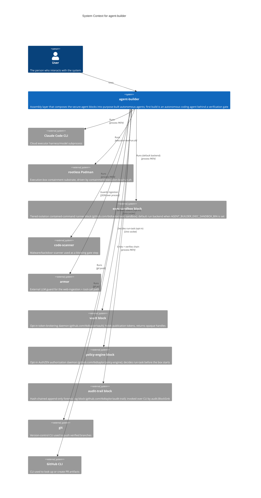
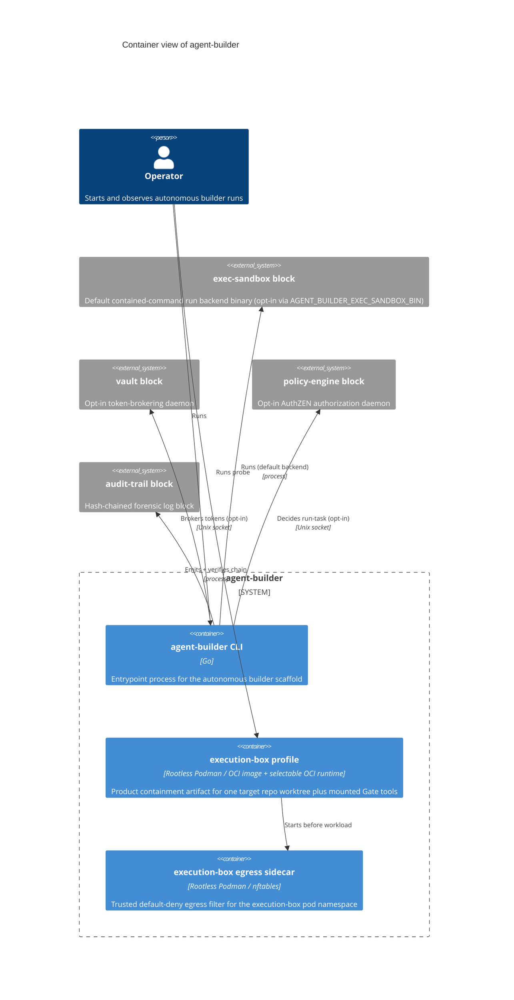
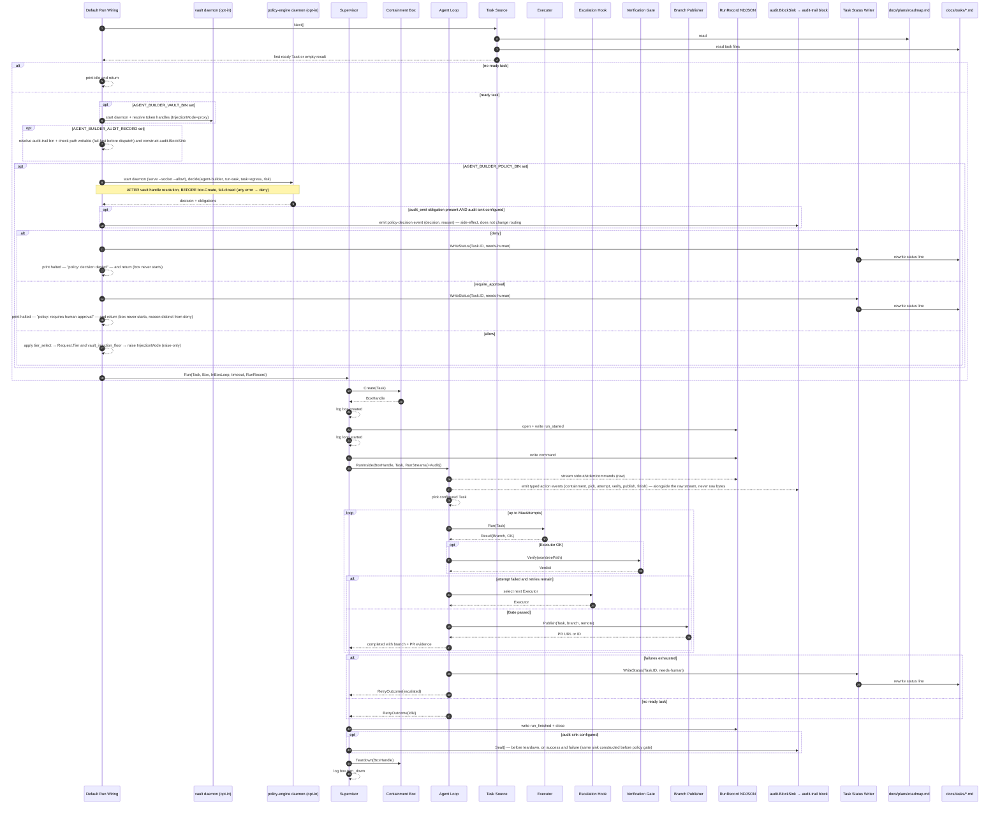
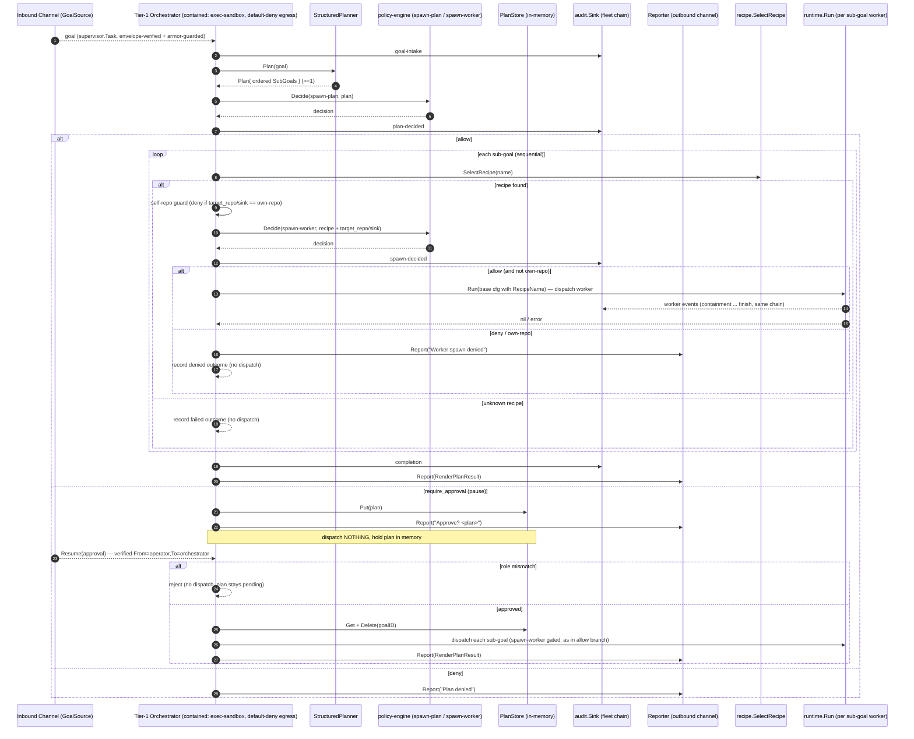

# Architecture Diagrams

**Project:** agent-builder
**Last updated:** 2026-06-28 (task 085 — orchestrator self-containment, per-worker spawn-worker gate, self-repo bright line, fleet audit chain)

C4-structured Mermaid diagrams covering the system at three progressively detailed levels (Context → Container → Component), plus the runtime sequence flows that show how those pieces collaborate. See [overview.md](overview.md) for prose context, [decisions/](decisions/) for the ADRs referenced here, and [`../spec/architecture.md`](../spec/architecture.md) for the structured element catalog these diagrams render.

These diagrams are part of the **authoritative spec** for this project. They are not just documentation about the code — they are a source-of-truth statement of how components are arranged and how data flows. Code changes that contradict a diagram either invalidate the change or invalidate the diagram; one must be updated to match the other in the same commit.

GitHub and most IDE markdown previewers render Mermaid natively — no build step required. Mermaid's `C4Context`, `C4Container`, `C4Component`, `C4Deployment`, and `C4Dynamic` blocks render as proper C4 diagrams.

> **Scaling rule.** Trivial systems (single container, no integrations) can collapse Container and Component into one section, or skip Container entirely. Large systems may split Component into one diagram per container (3a, 3b, …). The C4 levels are the *grammar* — use as many as the system actually needs. Per-flow runtime sequences (Section 4+) always belong here regardless of size.

---

## 1. System Context — who uses it and what it touches

---

## 2. Containers — deployable units inside the system

> The exec-sandbox, vault, policy-engine, and audit-trail blocks are external Systems (Section 2 of the catalog), not containers inside the agent-builder boundary. They are drawn here because they are deployable units the CLI starts/invokes at runtime, but they are owned and versioned independently — agent-builder holds only the typed client/adapter for each.

---

## 3. Components — modules inside the main container

```mermaid
C4Component
    title Component view of agent-builder CLI

    System_Ext(codeScanner, "code-scanner", "Malware/backdoor scanner CLI")
    System_Ext(claudeCLI, "Claude Code CLI", "Cloud executor harness/model subprocess")
    System_Ext(execBoxLauncher, "execution-box launcher", "containment/execution-box/run.sh — rootless Podman + selectable OCI runtime")
    System_Ext(execSandboxBlock, "exec-sandbox block", "Tiered-isolation contained-command runner block binary")
    System_Ext(armorTool, "armor", "External LLM guard process/service")
    System_Ext(vaultBlock, "vault block", "Token-brokering daemon (Unix socket)")
    System_Ext(policyBlock, "policy-engine block", "AuthZEN authorization daemon (Unix socket)")
    System_Ext(gitCLI, "git", "Version-control CLI")
    System_Ext(ghCLI, "GitHub CLI", "PR artifact CLI")

    Container_Boundary(boundary, "agent-builder CLI") {
        Component(main, "Main", "cmd/agent-builder", "Entrypoint and process exit handling")
        Component(cli, "Command Surface", "internal/cli", "Flag parsing and run/version/verify/verify-checkpoint dispatch with exit codes")
        Component(orchestrator, "Tier-1 Orchestrator", "internal/orchestrator", "Goal → Planner plan → policy spawn-plan gate (pause/resume approval) → per-sub-goal spawn-worker gate + self-repo deny → sequential dispatch via runtime.Run → typed PlanResult over Reporter. Itself contained (exec-sandbox, default-deny egress) and emits a fleet-audit chain across both tiers (task 085). Authors no code; no direct executor import (ADR 042/046/050)")
        Component(runtime, "Default Run Wiring", "internal/runtime", "CLI bootstrap that composes configured Phase 0 adapters")
        Component(supervisor, "Supervisor", "internal/supervisor", "Trusted outside-the-box dispatcher, lifecycle logger, run-record writer, and stable seams")
        Component(agentloop, "Agent Loop", "internal/loop", "Inside-the-box pick-attempt-verify cycle plus bounded retry policy")
        Component(ingestion, "Ingestion Boundary", "internal/ingestion", "Typed content/tool-call candidates plus guard/broker release seam")
        Component(armorAdapter, "Armor Guard Adapter", "internal/armor", "External armor invocation adapter for ingestion decisions")
        Component(executorHarness, "Executor Ingestion Harness", "internal/executorharness", "Executor-facing event wrapper that emits broker-reviewed release values")
        Component(executor, "Claude CLI Executor", "internal/executor", "Concrete supervisor.Executor adapter with explicit web/tool policy")
        Component(modelRouter, "Model Router", "internal/router", "Capability/cost-first router (ADR 043); Select() picks the cheapest eligible registry entry per dispatch and resolves it to a supervisor.Executor")
        Component(executorRegistry, "Executor Registry", "internal/registry", "In-process catalog of executor entries + env-var loader (LoadFromEnv); holds SecretRef, never a secret")
        Component(sandbox, "exec-sandbox Run Adapter", "internal/sandbox", "Typed contained-command seam and test fake")
        Component(podmanAdapter, "Podman Adapter", "internal/sandbox/podman", "Concrete Podman-backed sandbox.Runner via the execution-box launcher")
        Component(execsandboxAdapter, "exec-sandbox Backend Adapter", "internal/sandbox/execsandbox", "Block-backed sandbox.Runner; default backend when AGENT_BUILDER_EXEC_SANDBOX_BIN is set (ADR 035)")
        Component(secrets, "Secret Source", "internal/secrets", "SecretSource seam for token retrieval plus VaultSecretSource broker (vault_source.go)")
        Component(vaultClient, "Vault Client", "internal/vault", "Stdlib-only vault block socket client + daemon lifecycle (opt-in token brokering)")
        Component(policyGate, "Policy Gate", "internal/policy", "Fail-closed AuthZEN decide client + policy-engine daemon lifecycle (opt-in authorization gate)")
        Component(tasksource, "Task Source", "internal/tasksource", "Read-only roadmap/task parser and next-task selector")
        Component(statuswriter, "Task Status Writer", "internal/tasksource", "Constrained task status mutation")
        Component(gate, "Verification Gate", "internal/gate", "Ordered blocking checks with structured Verdicts")
        Component(publisher, "Branch Publisher", "internal/publisher", "Pushes verified branches and records PR artifacts")
    }

    Rel(main, cli, "Delegates to cli.Main")
    Rel(cli, runtime, "Dispatches run to the default pipeline")
    Rel(orchestrator, runtime, "Dispatches one worker per sub-goal via runtime.Run (reuse, not reimplement)")
    Rel(orchestrator, gate, "Selects recipe per sub-goal (recipe.SelectRecipe)")
    Rel(orchestrator, policyGate, "Decides spawn-plan (plan-level) + per-sub-goal spawn-worker (task 085); self-repo deny is fail-closed before the policy call")
    Rel(runtime, tasksource, "Selects one ready task")
    Rel(runtime, modelRouter, "Resolves RoutingSpec → entry via Select (ADR 043)")
    Rel(modelRouter, executorRegistry, "Selects cheapest eligible entry from catalog")
    Rel(runtime, executorRegistry, "Builds catalog via LoadFromEnv (default Claude entry when empty)")
    Rel(runtime, executor, "Constructs from the selected entry's harness driver")
    Rel(runtime, gate, "Constructs production Gate")
    Rel(runtime, podmanAdapter, "Constructs (fallback backend)")
    Rel(runtime, execsandboxAdapter, "Constructs (default backend when bin set)")
    Rel(runtime, secrets, "Reads tokens through SecretSource seam")
    Rel(runtime, vaultClient, "Starts daemon + resolves token handles (opt-in)")
    Rel(runtime, policyGate, "Calls Decide after vault resolution, before box Create (opt-in)")
    Rel(runtime, agentloop, "Constructs retrying in-box loop")
    Rel(runtime, statuswriter, "Constructs for escalation")
    Rel(runtime, publisher, "Constructs for post-Gate publication")
    Rel(runtime, supervisor, "Starts configured Run")
    Rel(supervisor, sandbox, "Stores Runner / box seam")
    Rel(podmanAdapter, sandbox, "Implements Runner seam")
    Rel(podmanAdapter, execBoxLauncher, "Invokes with worktree + typed limits")
    Rel(execsandboxAdapter, sandbox, "Implements Runner seam")
    Rel(execsandboxAdapter, execSandboxBlock, "Invokes with typed Request → argv")
    Rel(secrets, vaultClient, "VaultSecretSource brokers tokens")
    Rel(vaultClient, vaultBlock, "put / resolve over Unix socket")
    Rel(policyGate, policyBlock, "decide over Unix socket (fail-closed)")
    Rel(supervisor, gate, "Consumes Verdict model / Gate seam")
    Rel(agentloop, supervisor, "Consumes Task / Executor / Gate seams")
    Rel(executor, supervisor, "Implements Executor seam")
    Rel(executor, claudeCLI, "Invokes with task prompt")
    Rel(executor, executorHarness, "Routes Claude-facing web/tool events by policy")
    Rel(agentloop, tasksource, "Picks next task")
    Rel(agentloop, statuswriter, "Marks needs-human after exhausted retries")
    Rel(agentloop, executorHarness, "Uses when executor web/tool events are exposed")
    Rel(executorHarness, ingestion, "Builds candidates and reviews through Broker")
    Rel(executorHarness, armorAdapter, "Constructs armor-backed Guard wiring")
    Rel(ingestion, armorAdapter, "Calls Guard implementation")
    Rel(armorAdapter, armorTool, "Invokes over JSON")
    Rel(agentloop, gate, "Verifies target worktree")
    Rel(tasksource, supervisor, "Uses Task model")
    Rel(gate, codeScanner, "Runs in target worktree")
    Rel(publisher, gitCLI, "Pushes branch")
    Rel(publisher, ghCLI, "Finds or creates PR")
```

**Legend — load-bearing edges and boundaries** (the things you can't read off the boxes). The full contract catalog with ADR citations is the spec's job: see [docs/spec/architecture.md](../spec/architecture.md) §5 *Cross-cutting decisions*.

- **The orchestrator is Tier-1 above the worker stack** — it decomposes a goal, gates the plan on `policy.Decide` (`spawn-plan`, pause-and-resume on `require_approval`), gates each dispatch on a per-sub-goal `spawn-worker` decision with a fail-closed self-repo deny (task 085 / ADR 050; static half is fitness F-013), and dispatches one worker per sub-goal by **reusing** `runtime.Run`. It is itself **contained** (exec-sandbox profile, default-deny egress — L2 run-record posture; L6 live enforcement operator-deferred) and emits a **fleet-audit chain** spanning both tiers. It authors no code and has **no direct import of `internal/executor`** (the executor is reached only transitively through `runtime`, for the dispatched worker — `make fitness-orchestrator-no-executor`).
- **Supervisor is trusted and dumb** — it creates one box, runs one in-box loop, and tears down exactly once; no executor/LLM/web logic enters its graph.
- **Two run backends behind one `sandbox.Runner` seam** — `execsandbox.Runner` (default when `AGENT_BUILDER_EXEC_SANDBOX_BIN` is set) else `podman.Runner`; the retired `srt` backend is out-of-graph, not in the pipeline.
- **Policy decides before the box exists** — `decide` runs **after** vault resolution and **before** `sandboxBox.Create`; `deny`/`require_approval` means the box never starts.
- **Vault, policy, and audit are stdlib-only leaves** — one-way dependencies (`runtime`/`secrets` → `vault`, `runtime` → `policy`, supervisor → `audit.Sink` interface only); raw tokens never enter the RunRequest.
- **Ingestion is fail-closed** — attacker-reachable web/tool candidates pass an allow/block/quarantine guard; only broker-reviewed releases reach the executor.
- **Only Gate-verified non-empty branches publish** — the gate is the publication precondition; PR artifacts are recorded with token redaction.

---

## 4. Primary runtime flow

---

## 5. Orchestrator runtime flow — goal → plan → approval → dispatch

Tier-1 (`internal/orchestrator`, ADR 042/046). The orchestrator sits **above** the
Section-4 worker flow: each sub-goal it approves is dispatched by invoking
`runtime.Run` (the entire Section-4 sequence) once. The orchestrator authors no code
and reaches the executor only transitively through that dispatch.

**Load-bearing edges:** the `spawn-plan` decision (plan-level) is distinct from the
per-sub-goal `spawn-worker` decision (task 085) and from the worker `run-task` gate — a
dispatched worker is gated twice (spawn-worker + run-task), defense-in-depth. The
**self-repo bright line** denies any worker whose `target_repo`/`sink` is the own-repo
**before** the policy call, fail-closed (ADR 042/050; the static half is fitness check
F-013). The orchestrator itself is **contained** (exec-sandbox, default-deny egress —
L2 run-record posture; L6 live enforcement operator-deferred) and emits its own
**fleet-audit** events (`goal-intake`/`plan-decided`/`spawn-decided`/`completion`) onto
the SAME `audit.Sink` chain its workers write to, so one chain is tamper-evident across
both tiers. `require_approval` is **pause-and-resume**, not a terminal halt; `Resume`
asserts the verified envelope roles (operator → orchestrator) before acting (task 098
SEC-001); dispatch is one `runtime.Run` per sub-goal, sequential (concurrency is task
086).

---

## Adding more diagrams

Add additional numbered sections (5., 6., …) for any of:

- **Per-flow sequence diagrams** — error handling, reconnect, batch processing, auth, etc. One per flow that crosses two or more components and matters to operate the system.
- **State machines** — if a subsystem has explicit states with transitions
- **Deployment topology** — `C4Deployment` if the runtime layout (nodes, hosts, regions) is non-obvious
- **Dynamic collaboration** — `C4Dynamic` for showing how containers collaborate during a specific use case

One concept per diagram. If a diagram tries to show both a component layout and a runtime sequence, split it.

---

## Maintaining these diagrams

- **Trigger to update:** any time a new actor, container, or component appears; a boundary moves; an external dependency is added or removed; an ADR changes a diagrammed flow. Keep [`../spec/architecture.md`](../spec/architecture.md) in sync — the catalog and these diagrams describe the same elements.
- **Edit existing over adding new.** Duplicates rot independently. If a diagram has grown unwieldy, split it by extracting a self-contained subflow into its own numbered section.
- **Note ADRs that don't change diagrams.** When an ADR introduces a refactor that preserves the diagrammed runtime shape, add a one-line note here saying so. This prevents future contributors from re-asking "should this have been drawn?"
- **Update the date at the top** when you change anything substantive.
